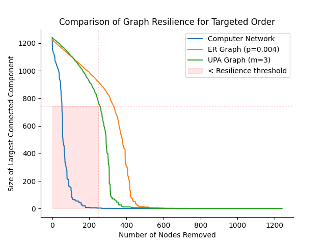

# Project/Application 2: Analysis of Computer Network Graphs

## Project Code (proj_2.py)
The Project component of Module 2 implements breadth-first search algorithms and uses these functions to compute the set of connected components (CCs) of an undirected graph as well as determine the size of its largest connected component. Another function computes the resilience of a graph (measured by the size of its largest connected component) as a sequence of nodes are deleted from the graph. These functions are utilized in the Application component of Module 2 to analyze the resilience of a computer network that is modeled by a graph represented as a dictionary. A more efficient challenge version of the BFS algorithm is implemented, which employs a find-union solution with disjoint sets. 

## Application Code (app_2.py)
This Application component of Module 2 analyzes the connectivity of a computer network while simulating a cyber attack in which an increasing number of servers are disabled. In computational terms, it models the network as an undirected graph and repeatedly deletes its nodes, measuring the resilience of the graph in terms of the size of the largest remaining connected component as a function of the number of nodes deleted. The functions in this component plot the resilience of various graphs as they undergo random and targeted attacks. Two different versions of an algorithm are included to determine the order of targets in a targeted cyber attack by iteratively identifying the graph's highest in-degree node and removing it. The comparative efficiency of these algorithms is analyzed and plotted using a customized time test function. 

### Notes on implementation:
* An object-oriented approach was taken that builds on the graph classes developed in Module 1. These classes have been augmented to allow for the creation of undirected graphs and several additional methods have been added to simulate random and targeted attacks on graph objects.

### Question 1:
Create the following three types of graphs:

1. An example **computer network**: loaded from a text file and modeled as an undirected graph
2. Undirected **ER graph**: random graph generated with size n = size of the computer network graph and edge probability p such that the graph has approximately the same number of edges as the computer network.
3. **UPA graph**: undirected version of DPA graph used in Module 1, generated with size n = size of the computer network graph and m value such that graph has approximately the same number of edges as the computer network.

For each of the three graphs, compute a random attack order and use this to compute the resilience of the graph. Plot the results as three curves combined in a single plot.

 ### Question 2:
 Consider removing a significant fraction of the nodes in each graph. A graph will be considered resilient under this type of attack if the size of its largest connected component is roughly (within ~25%) equal to the number of nodes remaining, after the removal of each node during the attack.

* **Examine the shape of the three curves from the plot in Question 1. Which of the three graphs are resilient under random attacks as the first 20% of their nodes are removed?** 
According to the specified criteria, all three graphs are considered resilient under random attacks.

### Question 3:
Implement the **fast_targeted_order** algorithm and then analyze its running time compared to the provided **targeted_order** on UPA graphs of size *n* with *m*=5.

* **Determine big-O bounds of the worst-case running times of targeted_order and fast_targeted_order as a function of the number of nodes *n* in the UPA graph.** 
The worst-case running time for **targeted_order** is O(n^2), since the function contains a nested loop structure that iterates over the number of nodes in each of the two loops.
The worst-case running time for **fast_targeted_order** is O(*n*), since the function performs a constant number of operations for each node and edge in the graph (*n* + *m*). Because the number of edges in the graph is specified to have an upper limit of 5*n*, *m* can be expressed in terms of *n* for big-O analysis and thus the function's time complexity is reduced to O(*n*).  

* **Compute a plot comparing the running times of these methods on UPA graphs of increasing size.**  

### Question 4:
Compute a targeted attack order for each of the three graphs from Question 1 and  compute the resilience of each graph using **compute_resilience**. Plot the computed resiliences as three curves in a single plot.

### Question 5:
**Examine the shape of the three curves from the plot in Question 4. Which of the three graphs are resilient under targeted attacks as the first 20% of their nodes are removed?** According to the specified criteria, the computer network graph is considered *not* resilient while the ER and UPA graphs are considered resilient. The curve of the UPA graph falls very close to the resilience threshold, and certain graphs generated by the same random process will fail the resilience test. However, the graph in this instance lies just above the resilience threshold and thus is considered resilient.

### Question 6:
**An increasing number of people with malevolent intent are interested in disrupting computer networks. If one of the two random graphs was found to be more resilient under targeted attacks than the computer network, should network designers always ensure that networks' topologies follow that random model? Think about the considerations that one might have to take into account when designing networks and provide a short explanation.** No, the designers should not universally follow a particular model solely based on resilience alone. Other factors such as cost and difficulty of implementation versus alternative models would need to be considered.