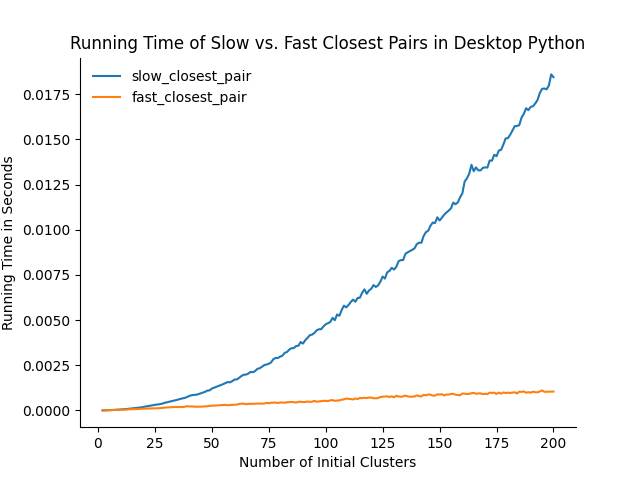
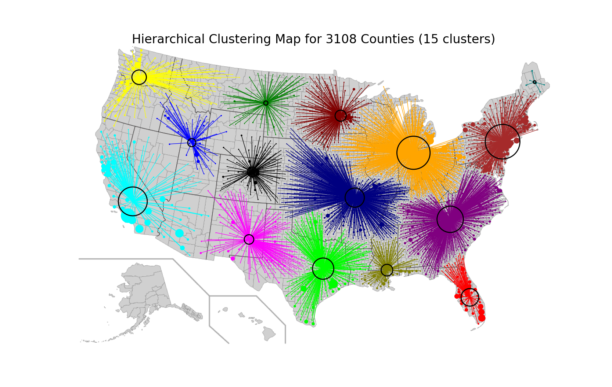
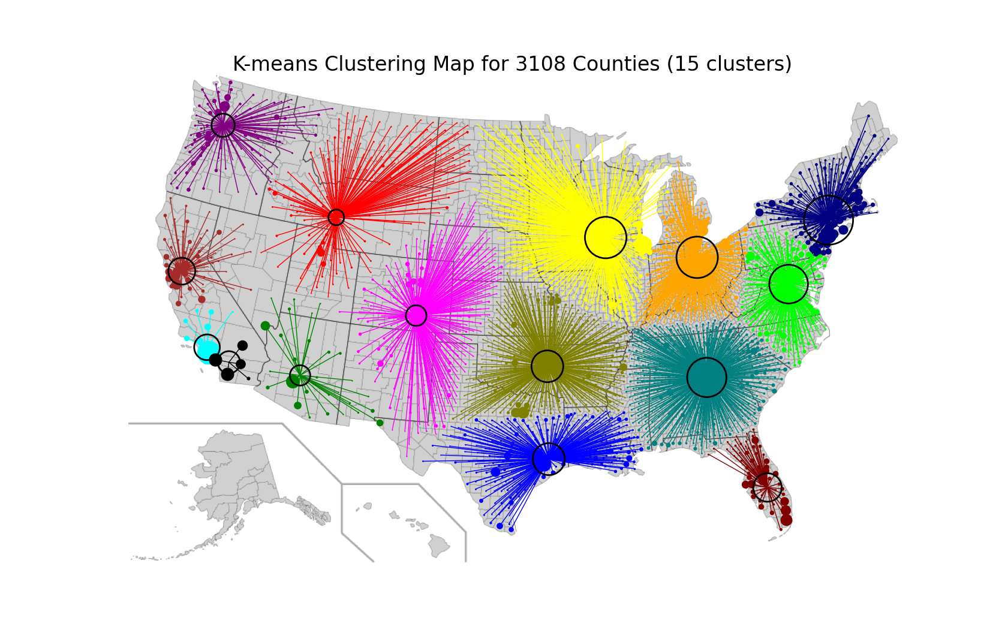
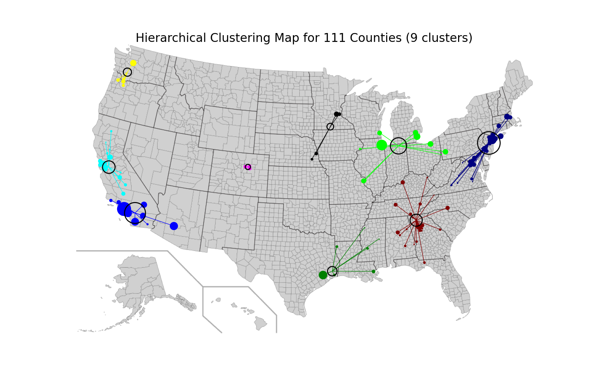
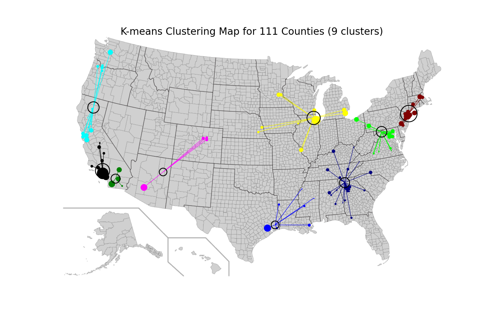
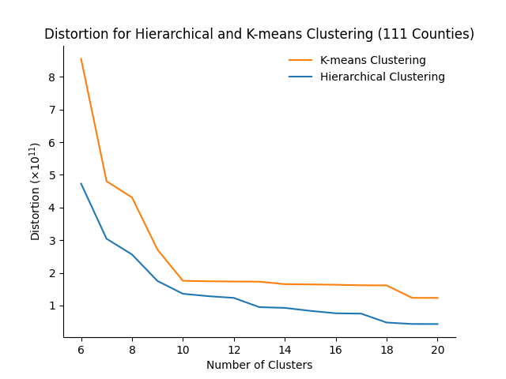
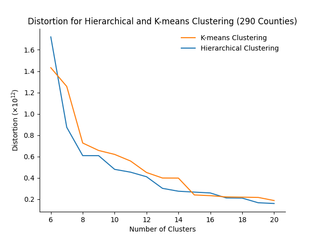
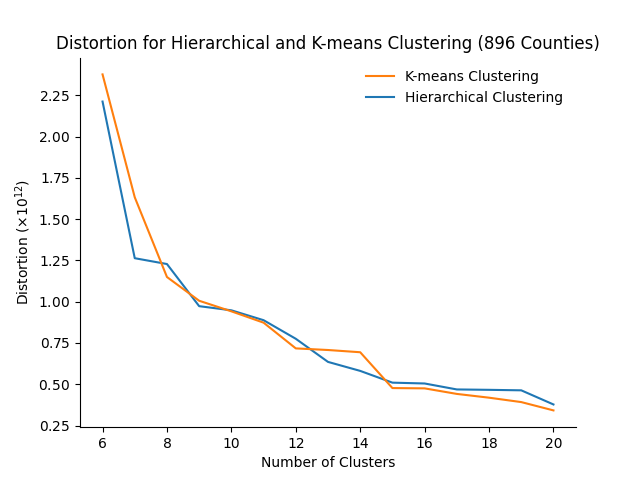

# Project/Application 3: Comparison of Clustering Algorithms
Author: Ian Burzynski

## Project Code (proj_3.py)
The Project and Application components of Module 3 implement and assess two methods for clustering data. Project 3 also implements two methods for computing closest pairs (**slow_closest_pair**, **fast_closest_pair**) and two methods for clustering data (**hierarchical_clustering**, **kmeans_clustering**). 

## Application Code (app_3.py)
This Application analyzes the performance of the two clustering methods on various subsets of a county-level cancer risk data set. In particular, it compares these two clustering methods in three areas:
* **Efficiency** - Which method computes clusterings more efficiently?
* **Automation** - Which method requires less human supervision to generate reasonable clusterings?
* **Quality** - Which method generates clusterings with less error?

### Notes on implementation:
* In addition to the provided Cluster class, this implementation makes use of an additional Clustering class to store lists of clusters as objects and conveniently plot and analyze their properties.

### **Question 1:**
Write a function **gen_random_clusters(num_clusters)** that creates a list of clusters where each cluster corresponds to one randomly generated point in the square with corners (±1,±1). Use this function to compute the running times of the functions **slow_closest_pair** and **fast_closest_pair** for lists of clusters of size 2 to 200 and plot the result as two curves combined in a single plot.

### **Question 2:**
Use the provided visualization code to create an image of the 15 clusters generated by applying hierarchical clustering to the 3108 county cancer risk data set. 
  

### **Question 3:**
Use the provided visualization code to create an image of the 15 clusters generated by applying 5 iterations of k-means clustering to the 3108 county cancer risk data set

### **Question 4:**
**Which clustering method is faster when the number of output clusters is either a small fixed number or a small fraction of the number of input clusters? Provide a short explanation in terms of the asymptotic running times of both methods.**  
The **fast_closest_pair** algorithm used in the hierarchical clustering method has a worst-case running time of $O(nlog^2n)$ and is called $n - k$ times, where $n$ is the number of input clusters and $k$ is the desired number of output clusters. Thus, if $k$ is either a small fixed number or a small fraction of $n$, the running time for hierarchical clustering is $O(n^2log^2n)$. The k-means clustering method's running time is $qkn$, where $q$ is the number of iterations. If the number of iterations is small and the cluster size is either a small fixed number or a small fraction of $n$, the running time is $O(n)$; therefore k-means is the faster clustering method.

### **Question 5:**
Use the provided visualization code to create an image of the 9 clusters generated by applying hierarchical clustering to the 111 county cancer risk data set.  
  

### **Question 6:**
Use the provided visualization code to create an image of the 9 clusters generated by applying 5 iterations of k-means clustering to the 111 county cancer risk data set. 

### **Question 7:**
Write a function **compute_distortion(cluster_list)** that takes a list of clusters and uses **cluster_error** to compute its distortion.  
**Compute the distortions of the two clusterings in questions 5 and 6.**  
* The distortion for the 9 clusters generated by hierarchical clustering on the 111 county data set is approximately $1.752 * 10^{11}$.  
* The distortion for the 9 clusters generated by k-means clustering on the 111 county data set is approximately $2.713 * 10^{11}$.  

### **Question 8:**
Examine the clusterings generated in Questions 5 and 6, focusing on the number and shape of the clusters located on the west coast of the USA. 
* **Describe the difference between the shapes of the clusters produced by these two methods.**  
The hierarchical clustering features more evenly distributed clusters along the West Coast, with one cluster centered near Seattle, Washington, one centered in Northern California near San Francisco, and one in Southern California centered in the Los Angeles area. The k-means clustering appears to merge Washington, Oregon and Northern California together into a single, poorly defined cluster centered at the top of California, and has two clusters in Southern California which appear to be centered near Los Angeles and San Diego.
* **What caused one method to produce a clustering with a much higher distortion?**  
The higher distortion seen in the k-means clustering is most likely due to the fact that the initial cluster centers selected in this method are based on population size, and as a result the concentration of high population counties in Southern California skewed the clustering. 

### **Question 9:**
**Based on your answer to Question 8, which method requires less human supervision to produce clusterings with relatively low distortion?**  
Hierarchical clustering requires less supervision to produce clusters with low distortion because it doesn't need any human interaction beyond the choice of the number of clusters. K-means clustering requires more supervision because the quality of the clustering varies based on the initial choice of cluster centers, so they must be chosen strategically to produce high quality output.

### **Question 10:**
Compute the distortion of the list of clusters produced by hierarchical clustering and k-means clustering (using 5 iterations) on the 111, 290, and 896 county data sets, where the number of output clusters ranges from 6 to 20 (inclusive). Create three separate plots (one for each data set) that compare the distortion of the clusterings produced by both methods.
  
  
  
  
  
  
  
### Question 11:
**For each data set (111, 290, and 896 counties), does one clustering method consistently produce lower distortion clusterings when the number of output clusters is in the range 6 to 20?**  
Hierarchical clustering consistently produces less distortion than k-means clustering for the 111 county data set.  Neither clustering method consistently produces lower distortion for the other two data sets.