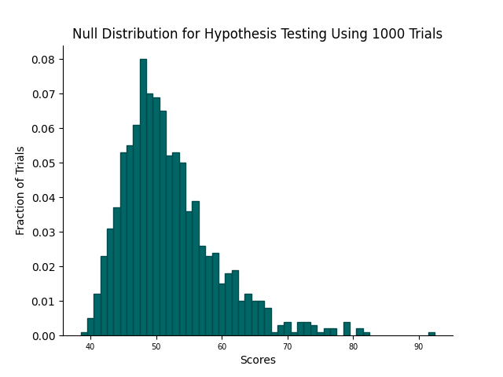

# Project/Application 4: Applications to Genomics and Beyond
Author: Ian Burzynski

## Project Code (proj_4.py)
Project 4 implements four functions. The first pair (**build_scoring_matrix**, **compute_alignment_matrix**) returns matrices that will be used in computing the alignment of two sequences. The second pair of functions (**compute_global_alignment**, **compute_local_alignment**) returns global and local alignments of two input sequences based on a provided alignment matrix. These functions are used in Application 4 to analyze two problems involving comparison of similar sequences.

## Application Code (app_4.py)
This application will demonstrate the utility of the algorithms above in two domains. The first part examines an interesting problem from genomics (based on *Introduction to Computational Genomics* by Nello Cristianini and Matthew W. Hahn). Two sequences are compared that have diverged from a common ancestor sequence due to mutation. (Mutation here includes base-pair substitution, which changes the sequence content, and insertion/deletion, which change the sequence lengths.) The second part considers words that have spelling mistakes.

### Notes on implementation:
* The Pickle library was used to cache the normal distribution dictionary created in Question 4, allowing for more efficient testing of subsequent functions.

### **Question 1:**
Load the files **HumanEyelessProtein** and **FruitflyEyelessProtein** using the provided code. These files contain the amino acid sequences that form the eyeless proteins in the human and fruit fly genomes. Then load the scoring matrix PAM50 for sequences of amino acids. This scoring matrix is defined over the alphabet {A, R, N, D, C, Q, E, G, H, I, L, K, M, F, P, S, T, W, Y, V, B, Z, X, -}, which represents all possible amino acids and gaps (the "dashes" in the alignment). 

**Compute the local alignments of the sequences of HumanEyelessProtein and FruitflyEyelessProtein using the PAM50 scoring matrix.**  

* **Alignment Score:** 875  
* **Human Alignment:**  HSGVNQLGGVFVNGRPLPDSTRQKIVELAHSGARPCDISRILQVSNGCVSKILGRYYETGSIRPRAIGGSKPRVATPEVVSKIAQYKRECPSIFAWEIRDRLLSEGVCTNDNIPSVSSINRVLRNLASEK-QQ  
* **Fruitfly Alignment:**  HSGVNQLGGVFVGGRPLPDSTRQKIVELAHSGARPCDISRILQVSNGCVSKILGRYYETGSIRPRAIGGSKPRVATAEVVSKISQYKRECPSIFAWEIRDRLLQENVCTNDNIPSVSSINRVLRNLAAQKEQQ  

### **Question 2:**
The file **ConsensusPAXDomain** contains a "consensus" sequence of the PAX domain; that is, the sequence of amino acids in the PAX domain in any organism. This problem compares each of the two sequences of the local alignment computed in Question 1 to this consensus sequence to determine whether they correspond to the PAX domain.

Load the file **ConsensusPAXDomain**. For each of the two sequences of the local alignment computed in Question 1, do the following:
* Delete any dashes present in the sequence.  
* Compute the global alignment of this dash-less sequence with the **ConsensusPAXDomain** sequence.  
* Compare corresponding elements of these two globally-aligned sequences (local vs. consensus) and compute the percentage of elements in these two sequences that agree.
    * **Human PAX Correspondence:** 72.9%  
    * **Fruitfly PAX Correspondence:** 70.1%  

### **Question 3:**
**Is it likely that the level of similarity exhibited by the answers to Questions 1 and 2 could have been due to chance? In particular, if comparing two random sequences of amino acids of length similar to that of HumanEyelessProtein and FruitflyEyelessProtein, would the level of agreement in these answers be likely?**
The length of the alignments for the human and fly proteins computed in Question 1 is 133, of which 125 characters match. This corresponds to a matching percentage of approximately 94%. Given the alphabet length of 23 amino acids, the odds of achieving this degree of similarity are roughly 1 in $10^{170}$; thus, the likelihood of this level of agreement due to chance are exceedingly small.

### **Question 4:**
Write a function **generate_null_distribution** that takes as input two sequences, a scoring matrix, and a number of trials. This function should return a dictionary that represents an un-normalized distribution generated by performing the following process for each trial:  
* Generate a random permutation of the second sequence.
* Compute the maximum score for the local alignment of the first sequence and randomized second sequence using the scoring matrix.  
* Increment the score entry in the dictionary by one.  

Use **generate_null_distribution** to create a distribution with 1000 trials using the protein sequences **HumanEyelessProtein** and **FruitflyEyelessProtein** using the **PAM50** scoring matrix. Then create a bar plot of the normalized version of this distribution.  

### **Question 5:**
Some very basic statistical analysis of this distribution can help to understand how likely the local alignment score from Question 1 is.
* **What are the mean and standard deviation for the distribution computed in Question 4?**
    * **Mean:** ~52.0
    * **Standard Deviation:** ~7.2
* **What is the z-score for the local alignment for the human eyeless protein vs. the fruitfly eyeless protein based on these values?**  
~114.1

### **Question 6:**
**Based on the answers to Questions 4 and 5, is the score resulting from the local alignment of the HumanEyelessProtein and the FruitflyEyelessProtein due to chance? As a concrete question, which is more likely: the similarity between the human eyeless protein and the fruitfly eyeless protein being due to chance or winning the jackpot in an extremely large lottery?**  
The z-score indicates that the alignment score for the human and fruitfly proteins falls approximately 114 standard deviations from the normal distribution's mean. By comparison, the odds of winning the American Powerball jackpot are 1 in 292,201,338, which corresponds to a z-score of approximately 6 standard deviations. The odds of the protein similarity being due to chance are so exceedingly small that they are basically indefinable; therefore the odds of winning any lottery are obviously much greater.

### **Question 7:**
Given two strings, the edit distance corresponds to the minimum number of single character insertions, deletions, and substitutions that are needed to transform one string into another. In particular, if *x* and *y* are strings and *a* and *b* are characters, these edit operations have the form:
* **Insert** - Replace the string *x* + *y* by the string *x* + *a* + *y*.  
* **Delete** - Replace the string *x* + *a* + *y* by the string *x*+ *y*.
* **Substitute** - Replace the string *x* + *a* + *y* by the string *x* + *b* + *y*.  

The edit distance for two strings *x* and *y* can be expressed in terms of the lengths of the two strings and their corresponding similarity score as follows: |*x*| + |*y*| - score(*x*, *y*) where score(*x*, *y*) is the score returned by the global alignment of these two strings using a very simple scoring matrix that can be computed using **build_scoring_matrix**.  

**Determine the values for diag_score, off_diag_score, and dash_score such that the score from the resulting global alignment yields the edit distance when substituted into the formula above.**
* **diag_score:** 2 
* **off_diag_score:** 1 
* **dash_score:** 0

### **Question 8:**
Implement a simple spelling correction function that uses edit distance to determine whether a given string is the misspelling of a word.

Load the list of 79339 words and write a function **check_spelling(checked_word, dist, word_list)** that iterates through the word list and returns the set of all words within edit distance of the checked word.

**Use the check_spelling function to compute the set of words within an edit distance of one from the string "humble" and the set of words within an edit distance of two from the string "firefly".**

* **Words within Edit Distance 1 of 'humble':** {'humbler', 'humble', 'bumble', 'fumble', 'humbled', 'rumble', 'tumble', 'humbles', 'humbly', 'mumble', 'jumble'}  
* **Words within Edit Distance 2 of 'firefly':** {'tiredly', 'liefly', 'direly', 'freely', 'fixedly', 'finely', 'fireclay', 'firmly', 'firefly', 'refly', 'firstly'}  

### **Question 9:**
**Reconsider the formulation of question 8 from a more general point of view and design a spelling correction tool that would provide real-time (almost instantaneous) correction of spelling errors within an edit distance of two.**  
  
My implementation of **fast_check_spelling** uses the following steps:

1. Initialize a set to record string variants, which initially contains just the checked word.
2. Set a counter variable equal to the maximum possible edit distance.
3. While the counter variable is greater than zero, do the following:  
    a. Create a copy of the variants set.  
    b. Iterate over each string in this copied set and do the following:  
        * Generate a set of all possible insertion variants by inserting each letter of the alphabet at each possible position in the string. Merge this set with the variants set.  
        * Generate a set of all possible deletion variants by deleting each letter of the string. Merge this set with the variants set.  
        * Generate a set of all possible substitution variants by substituting each letter of the alphabet with each letter in the string. Merge this set with the variants set.  
    c. Decrement the counter variable.  
4. Get the intersection between the variants set and the set of valid words from the word list via set operation and return this set.

To compare the running time of the two functions, I wrote a timing function and tested each function with 50 iterations using the word 'firefly' and a maximum edit distance of 2. The first function, **check_spelling**, had an average running time of 3.33 seconds, while **fast_check_spelling** had an average running time of just .05 seconds, making it almost 67 times faster.